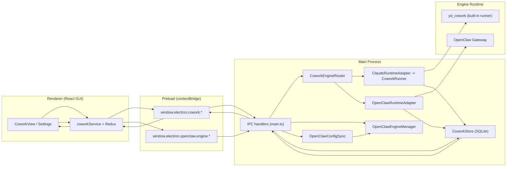
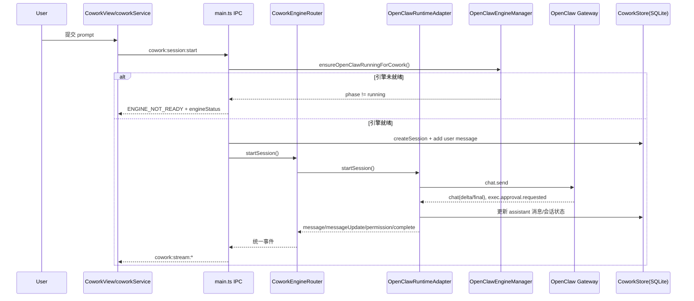

# LobsterAI 架构说明：OpenClaw、GUI 与 Cowork 的关系

## 1. 一句话结论

- `Cowork` 是产品能力层（会话、消息、权限、状态流转）。
- `OpenClaw` 是 `Cowork` 的一个可切换执行引擎（另一个是内置 `yd_cowork`）。
- `GUI` 通过 Electron IPC 驱动 `Cowork`，并通过独立的 `openclaw:engine:*` 通道管理 OpenClaw 运行时状态。

换句话说：**GUI 不直接承载业务语义，Cowork 承载业务，OpenClaw 承载其中一种运行时执行能力。**

## 2. 总体分层

## 3. OpenClaw / GUI / Cowork 关系拆解

### 3.1 GUI 层（Renderer）

- `CoworkView` 负责任务输入、会话展示、流式输出。
- `Settings` 提供两类关键配置：
  - `agentEngine`: `yd_cowork` / `openclaw`
  - `executionMode`: `auto` / `local` / `sandbox`
- GUI 通过 `coworkService` 统一访问：
  - 会话类接口走 `window.electron.cowork.*`
  - OpenClaw 引擎运行状态走 `window.electron.openclaw.engine.*`

### 3.2 Cowork 层（Main 业务编排）

- `CoworkStore` 保存会话、消息、配置（`cowork_config`、`cowork_sessions`、`cowork_messages`）。
- `CoworkEngineRouter` 是关键路由器：
  - 根据 `cowork_config.agentEngine` 决定用哪个 runtime。
  - 对外暴露统一事件：`message`、`messageUpdate`、`permissionRequest`、`complete`、`error`。
  - 引擎切换时清理活动会话，避免跨引擎上下文污染。

### 3.3 OpenClaw 层（引擎与网关）

- `OpenClawEngineManager`
  - 负责内置 runtime 校验、启动、状态机（`not_installed/installing/ready/starting/running/error`，其中 `installing` 仅兼容保留）。
  - 向渲染层广播 `openclaw:engine:onProgress`。
- `OpenClawConfigSync`
  - 把当前模型配置与 `executionMode` 同步成 OpenClaw 需要的配置文件。
  - 映射关系：
    - `local -> sandbox.mode=off`
    - `auto -> sandbox.mode=non-main`
    - `sandbox -> sandbox.mode=all`
- `OpenClawRuntimeAdapter`
  - 负责把 Gateway 事件（chat delta/final、approval request）转换为 Cowork 标准事件。
  - 把 OpenClaw 工具审批转换为 GUI 可处理的权限请求。

## 4. 一次会话的主路径（以 OpenClaw 为例）

## 5. 关键设计点

- 统一抽象：GUI 永远消费 Cowork 标准事件，不感知底层是 OpenClaw 还是 `yd_cowork`。
- 双通道职责清晰：
  - `cowork:*` 负责任务会话业务
  - `openclaw:engine:*` 负责 OpenClaw runtime 生命周期管理
- 配置联动：切换引擎或执行模式时，主进程会同步 OpenClaw 配置并按需重启网关。
- 降级与错误显式化：OpenClaw 未就绪时返回 `ENGINE_NOT_READY`，前端据此提示用户检查内置 runtime 与网关状态。

## 6. 你可以把它理解为

- `GUI`：控制台与展示层  
- `Cowork`：统一任务协议与状态机  
- `OpenClaw`：可插拔执行内核之一  

## 7. 关键代码入口（便于继续深入）

- `src/main/main.ts`
- `src/main/preload.ts`
- `src/main/libs/agentEngine/coworkEngineRouter.ts`
- `src/main/libs/agentEngine/openclawRuntimeAdapter.ts`
- `src/main/libs/agentEngine/claudeRuntimeAdapter.ts`
- `src/main/libs/openclawEngineManager.ts`
- `src/main/libs/openclawConfigSync.ts`
- `src/main/coworkStore.ts`
- `src/renderer/services/cowork.ts`
- `src/renderer/components/cowork/CoworkView.tsx`
- `src/renderer/components/Settings.tsx`
